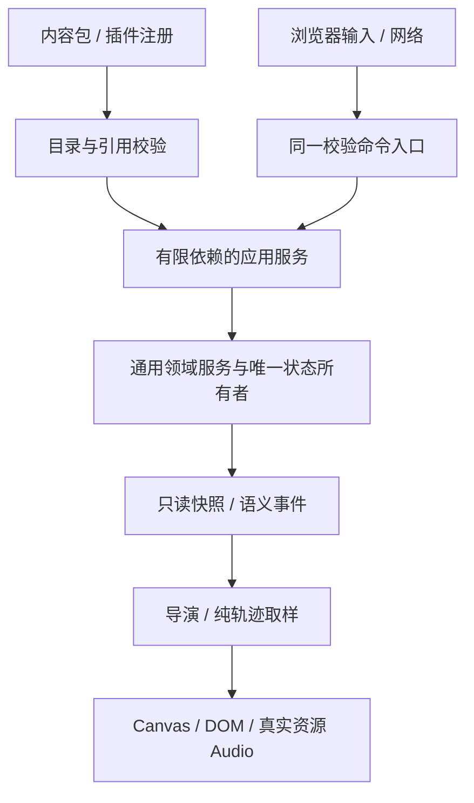

# 架构与扩展约定

当前工程 0.16.0：绿宝石序章内容包运行在可复用的格子探索、队伍/席位回合战斗引擎上。规则、应用协调、内容、演出与浏览器宿主分层；引擎合同与完整原作业务内容的完成度分别记录。

首先阅读 [README.md](README.md) 的运行入口和范围；执行顺序看 [ENGINE_ROADMAP.md](ENGINE_ROADMAP.md)，验证与已知问题看 [DEVELOPMENT_LOG.md](DEVELOPMENT_LOG.md)。本文定义当前结构，不把历史里程碑当作当前能力。

## 层次与依赖方向

```text
dist/
  app.js                         浏览器组合入口、生命周期与画面更新
  engine/                        通用领域服务，无 DOM/绘图/绿宝石包依赖
    battle/                      队伍/席位、目标、行动、阶段结算、状态、历史、事件
    rules/gen3/                  有来源的第三世代规则与数据
    growth/ / creatures/         培育、遗传、进化、形态身份与有效属性
    inventory*.js                可注册槽位容器、容量与原子计划
    items.js                     白名单草稿上的道具预检/提交
    story.js / commands.js       条件、剧情账本与校验后的指令执行
    world*.js                    网格世界、动态覆盖、访问与时间
    field-*.js                   野外会话、资格/行动、地形、机关与触发
    movement*.js / motion.js     移动模式/输入策略与可注入时钟的插值
    actor-repository.js          持续 Actor 身份、状态和命令
    npcs.js / npc-*.js           自主决策/姿态与占用
    pathfinding.js               复用世界规则的有界导航
    extensions/                 内容注册、查询、命令事务、界面与表现合同
    save-store.js                当前版本存储、原文保护，无迁移链
    contracts.d.ts               公开类型合同
  presentation/                  快照/语义事件 → 纯取样与演出帧
    battle-director.js           战斗导演及注册的事件演出
    effect-registry.js           可注册效果与招式脚本
    scene-director.js            场景时钟和状态
    *-canvas.js                  消费演出帧的 Canvas 绘制器
  adapters/                      浏览器输入、Canvas/DOM、存储与真实资源音频
  packs/emerald/                 原作规则配置、剧情、地图业务与页面
    adventure.js                 内容配置、应用装配、生命周期和忙碌聚合
    application/composition.js   20 个应用服务的有限依赖装配
    application/public-ports.js  当前宿主 API 的显式字段/方法所有权表
    application/*-application.js 按领域拥有会话、协调用例
    extensions.js                通用插件合同的本作校验/默认注册
    interface.js / ui-shell.js   页面装配与共用交互基础设施
    *-interface.js               独立页面，只查询和提交命令
  content.json                   基础地图、图集、物种与招式数据
  assets/                        共享图块、精灵、字体、真实音频与来源记录
```



`engine/` 不导入 `packs/`、`presentation/`、`adapters/`；表现层不重新计算伤害、命中或捕捉，不调用游戏随机数。具体规则注入领域服务，视觉注入注册表，跨应用调用通过组合入口提供的有限端口。架构测试检查依赖方向、模块引用和所有 UI 页面写状态的边界。

## 应用服务与状态所有权

`adventure.js` 当前 149 行；逐方法转发已移出，不能在入口增加新用例。`public-ports.js` 冻结列出每个公开方法/字段的所属服务，没有旧版本回退或自动暴露实例全部方法。方法保留服务接收者，调用时读取当前实例；UI 命令代理继续将操作路由到同一个 CommandBus。详见 [APPLICATION_ARCHITECTURE.md](APPLICATION_ARCHITECTURE.md)。

- SaveApplication 唯一持有持久 state、RNG 和保存保护；公共 state 读取同一对象。
- 其他服务各自拥有领域会话：世界、战斗、成长、时间、树果、Actor、机关、移动和野外行动。服务不导入兄弟服务，不收到完整 game 引用。
- 依赖端口为冻结的实时 getter。读档更换对象后读取新所有者；不会缓存旧 state。可信应用共享领域对象身份，插件获得只读查询和受控写入能力。
- 只有可信宿主的 state 重载和 storyBusy 控制保留显式赋值口；其他公共字段/方法不可覆写。测试故障注入对准用例所有者。
- bindField 重绑顺序：RNG → 形态 → 育成 → 时间 → 天气 → 树果 → Actor → 世界；世界再绑定移动、机关、野外行动和插件。有限的跨服务生命周期接线由 composition 管理。

## 世界、移动与时间

地图是 **16×16 metatile 网格**，每格从共享 **8×8 tile 图集**组装前后两层。connections 提供连续道路，warps 提供入口。规则不读取整张场景图片，世界 coordinates 与绘制像素分离。

WorldStateService 分离永久覆盖与当前访问 visit 覆盖；地图重进先预览入口再提交恢复，读档恢复当前访问。appearance 独立覆盖外观，不能偷偷改变碰撞/高度/behavior。玩家、静态 NPC、持续 Actor、寻路、视线和互动使用一致的高度政策与步进预约。见 [WORLD_STATE.md](docs/engine/WORLD_STATE.md)、[WORLD_LIFECYCLE.md](docs/engine/WORLD_LIFECYCLE.md)、[FIELD_ELEVATION.md](docs/engine/FIELD_ELEVATION.md)。

FieldActionService 拥有资格、目标和可校验行动计划；应用层协调移动/世界提交/钓鱼会话与演出。FieldTerrainRegistry 管通行和强制动作政策。FieldDeviceCatalog/FieldDevices 管多格 footprint、访问激活、逻辑状态与可保存的局部延迟任务；机关计时遵循游戏暂停，不使用 RTC 驱动帧动画。薄冰、裂地板和桥面升沉是内容包政策，核心没有房间 ID 分支。见 [FIELD_ACTIONS.md](docs/engine/FIELD_ACTIONS.md)、[FIELD_TERRAIN.md](docs/engine/FIELD_TERRAIN.md)、[FIELD_DEVICES.md](docs/engine/FIELD_DEVICES.md)、[BRIDGES.md](docs/engine/BRIDGES.md)。

MovementRegistry / MovementInputRegistry 分别描述模式和输入策略。Mach/Acro 原作控制在 Gen3 政策中，浏览器只映射逻辑输入。GridMotion / Sprite 序列负责插值和姿态帧，不决定规则。见 [MOVEMENT_INPUT.md](docs/engine/MOVEMENT_INPUT.md)。

WorldClock 保存本地游戏 RTC，并单独累计前台游玩时长；宿主注入 wallNow/playActive。恢复、设备时钟回退和离线策略显式处理。WorldSchedule 保存持久任务，事实/业务提交遵循应用可用时机；CropService 单独负责树果成长和浇水/收获。见 [WORLD_TIME.md](docs/engine/WORLD_TIME.md)。每日事件入口不代表全部每日原作业务已经完成。

WeatherRegistry / WorldWeather 管世界选择、坐标/脚本/地图来源、每日/前台周期及覆盖期限；BattleWeatherRegistry 管独立的战斗天气政策，入战复制身份。WeatherApplication 是唯一应用所有者，WeatherDirector 与注册画师只消费投影。见 [WEATHER.md](docs/engine/WEATHER.md)。

ActorRepository 保存全局身份与模板状态；ActorApplication 提供动态生成、相邻地图交通、只读感知/BFS、邻接互动、姿态和记忆协调。帧插值不写进存档。完整日程/行为模板待补；伙伴跟随按用户要求以后由插件实现。见 [ACTORS.md](docs/engine/ACTORS.md)。

## 战斗、剧情与育成

Battle 组合队伍、联盟/席位、行动与目标、状态生命周期、多回合/延迟行动、结算和快照服务。MoveEffectRegistry 是唯一效果描述入口；未知效果报错，明确未支持的效果不能花费 PP 或随机数。规则扩展通过阶段/操作/状态合同，而不是 UI 分支。运行目录有 354 个第三世代招式，完整语义仍待逐项核对。见 [BATTLE_ARCHITECTURE.md](BATTLE_ARCHITECTURE.md)、[机制矩阵](docs/engine/MECHANISM_MATRIX.md)、[MOVE_AUDIT.md](docs/engine/MOVE_AUDIT.md)。

StoryEngine 的事件、条件、依赖、变量、完成账本与奖励账本分离。数据化剧情可选择/分支/查询，CommandRunner 校验整树后按顺序/并行执行；同一角色/镜头不能被并行争抢。FieldDirector 用领域移动规则驱动剧情，场景入口在完全遮盖时提交，失败后释放控制。见 [STORY_LANGUAGE.md](docs/engine/STORY_LANGUAGE.md) 和 [CUTSCENES.md](CUTSCENES.md)。剧情运行中途恢复不是当前存档合同。

精灵创建、学习、友情、遗传、孵化、交易、进化和形态各有领域边界。道具服务只提交允许的草稿字段，不把任意对象修改当效果。注册学习方式、50 TM/8 HM 的兼容/槽位/库存/插件事务已针对性验证；五个正式关键道具已声明行动并检查实际库存，异步执行复用野外计划/导演；默认示范道具与特定药品/球命令别名已删除，登记/C/触屏SELECT与保存10已接入；槽位库存服务/注册政策及插件启动校验已实现，当前游戏获得/消耗、容量、选槽页面与保存10迁移已完成，见 [INVENTORY.md](docs/engine/INVENTORY.md)。见 [ITEM_ACTIONS.md](docs/engine/ITEM_ACTIONS.md)。见 [MOVE_LEARNING.md](docs/engine/MOVE_LEARNING.md)。见 [GROWTH_ARCHITECTURE.md](GROWTH_ARCHITECTURE.md)、[CREATURE_FORMS.md](docs/engine/CREATURE_FORMS.md)。现代 Mega/Z 还需行动增强、资格/消费/限次等合同，不能以形态动画宣称完整玩法完成。

## 表现、音频与界面扩展

动画描述、纯采样、导演和绘制分离：关键帧、具名缓动、结果分支、区间片段可复用；注册的战斗语义事件演出可追加/替换。计算可脱离浏览器测试、时钟可注入、reducedMotion 统一处理。效果只消费已确定的规则事实。见 [ANIMATION_CONTRACT.md](docs/engine/ANIMATION_CONTRACT.md)。跨 Canvas/DOM/SVG 宿主生命周期与可注册环境合同仍待收口。

AudioAdapter 只播放注册的真实 WAV/OGG/MP3/M4A 资源；管理解码缓存、音乐/音效通道、循环采样区间、音量、淡入淡出、后台续播和释放。内容使用语义 cue，插件请求自有注册音效；没有振荡器/合成旋律/频率提示 API。目前 7 个真实采样不是完整原作 BGM/SE 库，见 [AUDIO.md](docs/engine/AUDIO.md)。

interface.js 是页面装配器，ui-shell 提供对话/弹窗/导航/焦点，页面工厂只查询状态和提交应用命令。新增页面仍受架构守卫。插件可注册页面、现有菜单入口、HUD、声明式点击与数据/行为反馈；目前的槽位、控件、主题、既有页面区域和自定义对话能力仍有限。详见 [PLUGIN_ARCHITECTURE.md](PLUGIN_ARCHITECTURE.md)、[PLUGIN_EVOLUTION.md](docs/engine/PLUGIN_EVOLUTION.md)。网络协议控制当前单机，复用同一校验命令系统，不是多人权威同步。

## 存档、复用与验证

SaveStore 只接受开发存档版本 10；插件数据要求当前 dataVersion。核心迁移链、插件 migrate 和旧 game-pack.js 转出口已删除。失败读取不覆盖原文，写入前校验 detached draft、UID/引用与依赖。单一状态所有权、持久合同和失败原文保护仍必须维护。

制作同类游戏可复用 engine、导演和宿主适配器，以新内容包注入规则、地形政策、素材、剧情与 UI。当前目标为 2D 网格、单机探索、多队伍/席位回合 RPG；不能声称支持任意游戏类型。领域规则中的有来源数值可保留在规则包，不应为了消除“硬编码”把每条原作规则变成无约束回调。

`npm test` 验证领域、组合、失败原子性、时序和架构；`npm run check` 检查内容、严格公开类型和模块语法。最近全量基线（1851e9d）为 **556 项测试通过**；此后学习新增 14 项、天气新增 18 项、关键道具新增 13 项、快捷登记/商店修复新增 13 项、槽位库存核心新增 12 项、当前槽位应用迁移组合证明和受影响范围针对性验证，当前 **255 个 JS 模块语法通过**，证据见 [FINAL_VALIDATION.md](FINAL_VALIDATION.md)。受影响代码/合同变化才使对应记录失效，已通过且未变化的模块不重复验证。完整原作内容、设施业务与 E 最终浏览器验收仍未完成。
