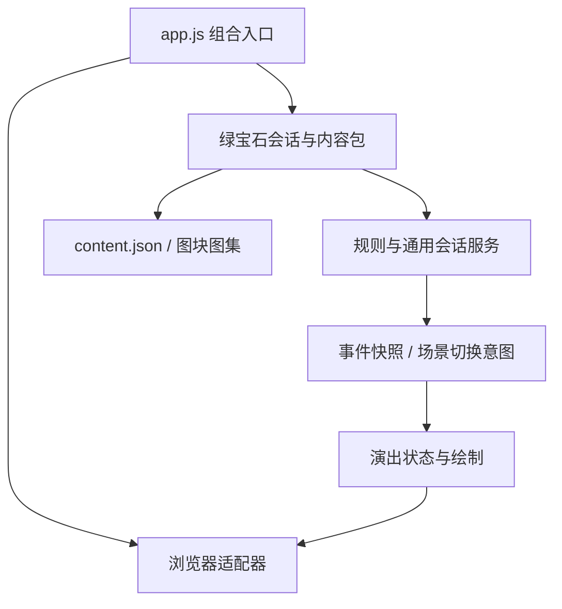

# 架构与扩展约定

本项目按可继续开发的软件工程维护。浏览器只是一个宿主；规则、内容、会话、演出与宿主适配器各有职责。当前依然是序章切片，不是完整原作。

## 目录和依赖方向

```text
dist/
  app.js                       组合入口，只装配依赖和更新画面
  engine/                      可在 Node 中运行，不引用网页或绿宝石剧情
    model.js                   第三世代数值、随机数、精灵和经验
    battle.js                  装配战斗领域服务
    battle/                    队伍、行动、回合、招式、临时状态、结算、事件
    effects.js / move-effects.js  操作注册与招式阶段定义
    items.js / conditions.js / story.js  道具试算提交、条件与剧情账本
    contracts.d.ts             内容、目标、组织与视图类型合同
    party.js                   恢复、首发、学习招式、等级进化命令
    world.js                   格子碰撞、连接、入口意图、调查探测
    motion.js                  连续世界坐标、相机用的插值、四向帧表
    npcs.js                    巡走、朝向、目标与出发格占用
    field-session.js           移动结束后处理脚步事件和入口转场
    battle-session.js          串行行动、演出锁、战斗进入/退出
    timeline.js                可注入时钟，遮盖→提交→揭开的转场协议
    commands.js                按顺序等待执行剧情指令
    field-director.js          接管角色、靠近/跟随/表情、演出作用域与参数校验
    pathfinding.js             复用 World 规则的有界寻路
    camera.js                  世界坐标镜头聚焦、插值与平滑回归
    content.js                 内容尺寸、图块和数据库引用校验
    save-store.js              存储端口、版本检查与迁移链
  presentation/                把事件变成画面；不决定规则结果
    duel-view.js               席位集合投影到单打画面
    battle-director.js         快照→血条、精灵姿态、粒子与球的状态
    battle-canvas.js           战斗画面绘制
    transition-dom.js          遮盖 Canvas、菜单和 HUD 的转场层
    field-canvas.js            语义表情→像素气泡，不读取剧情进度
  adapters/                    浏览器有关的输入、绘图、音效与工具接口
    canvas-renderer.js         可视范围内的网格、图块、角色绘制
    browser-input.js           键盘/触屏→命令；可解除绑定
    audio.js                   合成提示音的宿主实现
    browser-tools.js           可选 WebMCP；不绕过游戏规则
  packs/emerald/               本作的上层建筑，允许了解具体角色和物品
    pack.js                    素材标识、起点与 NPC 内容
    trainers.js / items.js / quests.js  训练家、道具、任务定义
    save-contract.js           当前开发存档校验，不配置旧档迁移
    story.js                   互动和战后故事→指令序列、招式动画配置
    scenes.js                  本作的求救、背包、回研究所和治疗演出数据
    adventure.js               会话装配、遭遇、本作商店/奖励和命令入口
    interface.js               UI 装配器和主菜单入口
    ui-shell.js                对话、弹窗、导航、焦点与共享视图片段
    *-interface.js             队伍、背包、图鉴、商店、盒子、存档等页面
  game-pack.js                 旧调用方的兼容转出口
  content.json                 结构化地图、图集定义、精灵、招式和遭遇表
```



`engine/` 不导入 `packs/`、`presentation/`、`adapters/`；`presentation/` 不导入剧情，不调用伤害、捕捉或游戏随机数。依赖通过构造器传入，不使用全局服务定位器。主入口没有博士、小遥、商店或伤害规则。架构测试检查这些约束和模块路径。

## 状态所有权和输入边界

- 持久进度由 `EmeraldAdventure.state` 持有；地图和战斗规则通过该会话提供的对象工作。
- `interface.js` 读取状态、发送命令，不能直接修改持久状态。购买、回复、换队、学习、进化、导入都走会话命令；会话再次验证战斗/移动锁及资源条件。
- `Battle` 执行一次行动，输出带席位集合、UID、行动 ID 的精简独立快照。规则对象可变，事件快照与演出姿态独立，血条动画不会修改真实 HP。
- `FieldSession` 在当前格移动结束后才触发草丛遭遇，避免脚还没落地就进入战斗。未白镇与道路在同一全局网格中，连接不需要转场。
- 房屋入口先返回目标意图，人物走到门口，再由 `TransitionController` 完全遮盖画面、提交目标位置、揭开新场景。战斗退出先回到野外，后续剧情保持指令原始顺序；传送不会被提前提取执行。剧情的 `scene` 在完全遮盖时切换并布置入口人物，再播放进场走路。
- `FieldDirector` 在剧情作用域内接管角色。剧情走路复用地图碰撞和移动插值，但不触发随机遇敌或自动门；NPC 的自主行动暂停，脚本轨道正常推进。镜头和像素表情属于临时状态，不写进存档。
- 指令整树先校验。并行轨道不能同时控制同一角色或镜头，切场景不能与其他轨道并行。失败会等待正在执行的其他轨道结束并释放作用域，不把中间演出自动保存。
- `BattleSession` 拒绝演出期间的重复行动。每个回合的规则计算和动画串行执行。战斗结束后在第一个对话输入点返回，剧情指令自己等待玩家确认；不能把工具调用锁死到整段剧情结束。
- 环境 NPC 的随机数与战斗 PRNG 分开，动画没有随机数，因此帧率不会改变遭遇、伤害或捕捉结果。时钟与等待方法可注入，测试无需真实等待动画。

这是单人游戏，采用受控的共享领域对象，而不是把所有状态每帧深复制。UI 不写领域状态的规则由架构测试保护。未来联机需要另加权威服务器和同步协议，不能直接拿目前的本机会话当服务端。

## 扩展入口

### 新地图 / 素材

1. 加入 `maps[id]` 的尺寸、`blocks`、`behavior`、`border`、`tileset`、`indoor`、`connections`、`warps`、`npcs`、`signs`。
2. 图片是共享 **8×8 原始图块图集**。一个 **16×16 metatile** 由 8 个图块描述前后两层；地图是格子 ID 数组，不能以一张整景图片替代。
3. 连接声明方向/目标/偏移，门声明目标入口序号。`SceneGraph` 自动把相连地图放入同一坐标系。
4. NPC 在内容包声明 `movement.mode`、范围和方向，复用巡走与占用逻辑。
5. 运行内容校验与可达性测试。未收录的原作入口允许存在，玩家调查时明确提示，不把它当成可玩区域。

### 新剧情

`story.js` 返回指令，而不是操作 DOM。例如：

```js
[
  { type: "dialog", name: "研究员", lines: ["找到它了！"] },
  {
    type: "reward",
    id: "research.sample",
    flags: { sampleReceived: true },
    items: { potion: 1 },
  },
  { type: "teleport", position: { map: "SomeLab", x: 3, y: 5, dir: "up" } },
];
```

StoryEngine 按 id/trigger/requires/after/once/build 注册事件，选择条件与依赖符合的事件，分别记录完成和奖励账本并校验依赖循环。内容包为 `CommandRunner` 注入指令处理器。对话确认完成才执行奖励，传送使用同一转场服务。未知指令明确抛错。新的指令种类在注册表增加处理器；既有引擎不需要理解角色名。

现在还支持自动行走、靠近、跟随、朝向、等待、表情、镜头聚焦/回归、场景布置以及顺序/并行组合。具体的指令合同、角色 ID、控制释放、复用例子和边界见 [CUTSCENES.md](CUTSCENES.md)。NPC 跨房间用明确场景布置；当前不支持长剧情中途存档或把战斗作为可恢复的暂停指令。

### 新招式 / 动画

招式效果通过唯一 MoveEffectRegistry 注册阶段描述符；道具通过上下文、目标和效果试算提交。具体说明见 [ENGINE_EVOLUTION.md](ENGINE_EVOLUTION.md)。

Battle 已拆出队伍、行动、回合、招式、临时状态和结算服务，rules 注入计算与政策。事件使用 combatants[] 和 sides[]，携带来源/目标席位和 UID，领域层不输出固定 player/enemy。单打表现适配器才生成双角色视图。模型、示例和结算边界见 [BATTLE_ARCHITECTURE.md](BATTLE_ARCHITECTURE.md)。

招式脚本通过 PresentationRegistry 注册，Director 解释多轨时间线，Canvas 通过注册效果绘制；未配置招式保留通用 profile 回退。动画不重新判定命中、伤害或捕获。插件可登记绘制函数、招式覆盖、场景、转场和音频。详情见 [PRESENTATION_ARCHITECTURE.md](PRESENTATION_ARCHITECTURE.md)。

已支持：遭遇遮盖、双方进入、接触攻击、属性弹道、辅助招式波纹、受击闪烁/震动、HP 插值、倒下下沉、换人缩放释放、回复粒子、投球弧线、按真实结果晃球、挣脱释放和成功封球。减少动态效果模式保留时序与转场，移除抖动和闪烁。

当前是匹配像素风格的通用演出，**不是每个原作招式的逐帧动画复刻**。后续可替换某个 profile，而不用修改伤害公式。

### 存档版本

`SaveStore(storage, key, validate, version, { migrations })` 注入本地/内存/其他存储；读取先做顺序迁移，再验证内容引用。迁移函数按旧版本号注册，读操作不覆盖原始存档，未知未来版本拒绝读取。本作开发存档版本为 6，按用户授权移除了旧档迁移表，拒绝旧版本。当前结构要求唯一精灵 UID 和剧情账本；存档键按内容包隔离。

### 另一个同类游戏

保留 `engine/`、通用 director 和输入适配器，建立新的内容包，替换数据库、图集、玩家角色配置、故事、名称和 UI 主题，在 `app.js` 装配新会话。`canvas-renderer.js` 的玩家素材通过 `playerActors` 注入，没有固定小悠；格子规格和 320×224 逻辑视口是当前绘图接口约定。

测试已经用 `Meadow/Cabin` 的独立小地图运行 `FieldSession` 和门转场，没有引用绿宝石 NPC、剧情或 DOM。当前可复用目标是 **16px 格子、单人探索、单打回合制捕捉 RPG**，不是任意类型游戏的万能框架。原作地形行为码、默认第三世代规则与中文默认战斗文案属于现有约定；其他地形规则、语言和玩法需要对应规则/内容适配。

## 维护方式和剩余边界

- `npm test`：领域规则、完整序章可达性、资源合同、时序边界、迁移和依赖方向检查。
- 内容导入工具保留在 `tools/`，来源与许可保留在 README 和 assets/licenses。
- 代码已统一格式，模块职责、接口和时钟均可单独测试，不靠浏览器跑出一个“看起来没问题”的结果。
- 当前没有内容编辑器或多人同步。插件 API 1、事务化状态、声明式 UI、事件与命令已实现；剧情 build 由内容包或插件返回校验后的演出指令。
- 当前 UI 已按页面工厂拆分，ui-shell 管理基础设施，interface.js 仅负责装配与主菜单。
- 双打/多阵营与特性/持有道具规则已有实现，范围和跨领域验收进度见 BATTLE_ARCHITECTURE.md、GEN3_RULE_COVERAGE.md 与 IMPLEMENTATION_PLAN.md；插件和网络入口详见各自架构文档。

剩余目标见 [IMPLEMENTATION_PLAN.md](IMPLEMENTATION_PLAN.md)。当前采用 JS、JSDoc/声明文件与运行时校验，尚未启用全项目 TypeScript 静态检查。可复用范围包括格子探索、队伍/席位战斗、剧情、培育与进化、插件事务、命令协议及注册式表现；不是完整通用游戏编辑器。

## UI 页面装配（0.12）

`createUIShell(game, {document, tone})` 管理弹窗、对话、焦点、返回和通知。页面采用 `createXInterface(game, deps)` 工厂，只读取状态并发送应用命令。页面间通过注入的导航回调协作，不互相导入；成长提示由 growth-interface 管理。interface.js 仅装配 shell、页面、扩展 DOM 和主菜单，保留 app.js 使用的动态 getter 与原返回接口。

状态写入守卫递归覆盖内容包中所有 `*-interface.js`、interface.js 和 ui-shell.js，拆分不会让新页面逃逸检查。独立 DOM 端口测试使用冻结状态验证装配、对话和可见控件焦点循环，浏览器验证详情页插件点击和保存。此阶段全量 300 项测试通过。

应用会话保留有意采用的宽门面和共享领域对象，避免机械改名。真正需要隔离的扩展入口使用 PluginHost 的只读查询、权限化事务、声明式 UI 及 CommandBus。页面、本地自动化与协议 1 网络请求共用命令验证。详情见 [PLUGIN_ARCHITECTURE.md](PLUGIN_ARCHITECTURE.md) 与 [NETWORK_ARCHITECTURE.md](NETWORK_ARCHITECTURE.md)。
