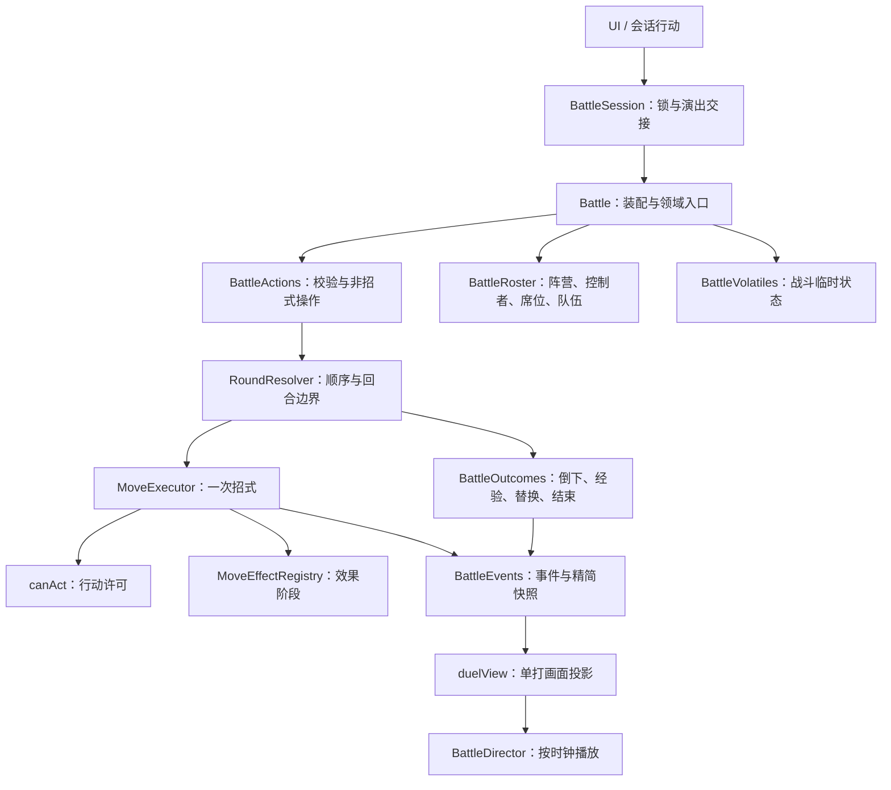

> 当前入口补充（0.15.0，2026-10-03）：下面按版本保留了历史设计。当前保存版本为 8，SaveStore 不再支持迁移器；已存在插件只读查询/受权限命令/事务/规则修饰和网络排序，见 PLUGIN_ARCHITECTURE.md 与 NETWORK_ARCHITECTURE.md。天气现在由独立注册与来源映射管理，详见 [WEATHER.md](docs/engine/WEATHER.md)；历史阶段的“尚未提供”不代表当前状态。

# 战斗架构（v0.5–v0.7）

当前已实现队伍化单打、双打、本地多阵营、统一规则阶段及特性/持有道具战斗与野外联动。育成可玩验收、移动模式、插件宿主与网络入口按 IMPLEMENTATION_PLAN.md 继续执行。下文保留基础模型说明和分阶段变更。

## 职责与依赖



领域模块不导入内容包、浏览器或表现层。`Battle` 保留少量装配和单打便利方法，不再在一个 executeMove 中处理整个战斗。`BattleSession` 只串行执行领域结果与演出，通过 `onResult` 将战后剧情交给内容包。

| 模块                        | 所有权与职责                                        | 不承担的职责               |
| --------------------------- | --------------------------------------------------- | -------------------------- |
| `battle/roster.js`          | 阵营、联盟、控制者、席位与后备查询；拓扑校验        | 不决定行动顺序、不播放动画 |
| `battle/actions.js`         | 行动预检、替换、道具与逃跑                          | 不计算完整回合、不发经验   |
| `battle/round.js`           | 单打优先级/速度排序、回合伤害、替换时机             | 不绘制、不选择剧情         |
| `battle/readiness.js`       | 睡眠、冰冻、麻痹、畏缩、混乱及忍耐的行动许可        | 不减少 PP、不排序          |
| `battle/moves.js`           | PP、命中、伤害与已注册效果的阶段执行                | 不发奖励、不换人           |
| `battle/outcomes.js`        | 按 UID 去重倒下；每个敌人的参战者经验；队伍结束判定 | 不包含博士、小遥、金钱剧情 |
| `battle/volatiles.js`       | 每席位临时状态；离场重置、回合清理                  | 不保存领域外的动画状态     |
| `battle/events.js`          | 序号、行动 ID、来源/目标 UID 和独立视图快照         | 不序列化整份精灵/队伍      |
| `presentation/duel-view.js` | 席位集合映射到现有双角色画面                        | 不改变战斗状态             |

## 身份与组织合同

类型位于 `dist/engine/contracts.d.ts`；运行时校验位于 `BattleRoster` 和内容校验器。

- `Side.id` 是组织单位，`allianceId` 表示联盟；一个联盟可以包含多个 Side。
- `Controller` 负责一份队伍及决策来源，当前支持 human/ai。一个 Side 可以有多个控制者。
- `Seat.id` 表示场上位置，归属于一个控制者。替换改变席位上的队员，不改变席位 ID。
- `Monster.uid` 表示个体，换位、寄存、进化不重新生成 UID。不同队伍/盒子不可出现重复 UID。
- `TargetRef` 区分 self / seat / side / field。未知引用明确报错。

示例：

```js
const topology = {
  sides: [
    {
      id: "home",
      allianceId: "home",
      controllers: [{ id: "human", kind: "human", party }],
      seats: [{ id: "home:0", controllerId: "human" }],
    },
    {
      id: "away",
      allianceId: "away",
      controllers: [{ id: "trainer", kind: "ai", party: enemyParty }],
      seats: [{ id: "away:0", controllerId: "trainer" }],
    },
  ],
};
```

同一个控制者增加第二席位可表示双打；增加控制者可表示伙伴；增加联盟可表示三阵营。`BattleRoster` 能验证这些组织，但当前 `Battle` 入口明确拒绝非单打配置。P2 将统一调度多席位行动并更换画面投影，不让尚未实现的模式静默进入单打规则。

## 行动与事件

当前行动：move / switch / item / run。保留 potion / ball 作为现有调用的别名；新道具统一使用 `{kind:'item',item:'super_potion',index:0}`。可传 actor UID，拒绝过期角色发起行动；单打只接受敌方席位作为显式招式目标。有效行动由引擎分配行动 ID，拒绝的行动不推进回合、PP、库存或随机数，也不沿用上个行动 ID。

```js
{
  kind: 'hurt', text: '攻击命中了！', round: 1, sequence: 2,
  actionId: 'action:1',
  actorSeat: 'home:0', actorUid: 'creature-A',
  targetSeat: 'away:0', targetUid: 'creature-B',
  combatants: [
    {seatId:'home:0',sideId:'home',controllerId:'human',monster: /* 精简视图 */},
    {seatId:'away:0',sideId:'away',controllerId:'trainer',monster: /* 精简视图 */},
  ],
  sides: [{id:'home',allianceId:'home',total:2,remaining:2}, /* ... */],
}
```

领域事件不含固定 player/enemy/side 数字。精简视图复制 UID、物种、等级、性别、HP、状态、经验及最大 HP，不复制 IV、EV、全部招式或盒子。快照与领域对象不共享引用；它们没有被冻结为不可写对象，消费方仍需遵守只读约定。单打的 player/enemy 投影仅存在于表现层。

当前行动 ID 标识一次玩家请求及其 AI 回应；每个事件的 actor UID 区分实际执行者。P2 会扩展为逐个排队行动的独立 ID；P3 增加规范化的结算阶段与触发调度。暂不把当前字段当成冻结的插件公共协议。

## 结算与表现规则

1. 敌方倒下一只，先记录倒下与经验；还有活队员时不结束。
2. 敌方后备在该回合全部已发生的行动与持续伤害之后入场，不获得同回合免费攻击，也不继承前任的能力等级、混乱等临时状态。
3. 每击败一只敌人，按该次对阵中实际上场且存活的 UID 分配经验；下一只入场后重新记录参战者。经验/努力值只结算一次。
4. 主动换人占回合；己方倒下后的强制替换不占回合、不选择 AI 招式、不推进随机数。这由 `forcedReplacementFree` 明确配置。
5. 当前敌方按第一个合格后备替换；招式随机选择，尚未实现原作训练家 AI。双方同时耗尽队伍时默认判己方失败，由 `rules.outcome` 明确给出；多阵营胜负留待 P2。
6. 训练家战斗全程禁止捕捉与逃跑。只有完整战斗结束，内容包才选择一次战后剧情；奖励账本再保证重赛不重复领钱。
7. 动画消费顺序快照。敌方倒下后隐藏正确角色，换人重新释放对应席位；名称、等级、HP 和经验条读取同一表现快照，避免换人中混用旧血条与新名称。
8. 构造失败先于入场转场。战后计划在退出转场重试时复用，避免重复调用结果处理器。

## 内容与存档

`packs/emerald/trainers.js` 定义训练家及队伍；`createTrainerTeam` 在消耗随机数之前校验全部成员。`story.js` 决定何时开战与如何发奖励。101 号道路的练习训练家在救助博士后可挑战，带 Lv.3 蛇纹熊和 Lv.4 土狼犬；首次全队获胜奖励 ¥160。此可选练习赛用于验收新机制，是本项目新增内容，不声称来自原版剧情；原来的小遥单精灵对战保持不变。

开发存档版本改为 3，去掉本作旧存档迁移表。校验器移到 `save-contract.js`，验证当前结构、内容引用、地图边界、唯一 UID 和剧情账本。通用 `SaveStore` 仍支持其他游戏按需注入迁移器；本内容包不配置迁移，拒绝旧版本。当前只保存探索稳定状态，不能在回合/剧情动画中途保存。

## 本轮验证与后续

84 项自动检查通过，新增 15 项覆盖敌方后备、替换时机、经验归属、双方倒下、非法输入不改变随机数、麻痹行动检查、事件脱离对象引用、拓扑校验、动画隐藏、内容预检、奖励去重和存档身份。架构检查已递归覆盖 engine 子目录。

浏览器验证了真实菜单换人、敌方换人、全队胜利、首次奖励、重赛不再领钱、道具恢复与保存重载。后续遵循 P2 → P3 → P4 → P5 → P6 → P7；每阶段都要有领域实现、可玩入口、表现、测试与文档。插件查询只读、命令提交、注册生命周期、数值修饰器和网络请求排序尚未提供，不能让插件直接持有核心可写状态来绕开这些边界。

## v0.6 多席位

BattleDecisions 按席位收集动作，不在选择过程中消耗规则随机数。共享背包和候补队员有预留检查；取消只清除尚未执行的动作。RoundResolver 在人类控制者提交完成后调用可注入的 AI，再按优先级、速度和稳定随机平局排序。AI 输出也经过同一个动作验证器。

BattleTargeting 从招式数据解析单体、自身、对方群体和全体其他角色；执行时重新解析倒下/替换后的目标。群体招式只消费一次 PP，行动效果与目标效果分开，反伤和吸取按本行动累计伤害执行一次。阵营的联盟标识决定敌我，核心不固定两支队伍。

BattleOutcomes 按个体 UID 记录倒下和经验参与，每次只结算一次；回合末按控制者候补池补位。没有候补的席位为空，三阵营不会因第一支敌队淘汰而结束。

表现层 battle-view 和 BattleDirector 接收 combatants 集合，按席位定位、插值、入场和倒下。battle-interface 负责光标与目标选择，通过普通命令调用领域服务。101 号道路的两名练习员提供双打和三阵营入口（救助完成、两只可战斗伙伴）。

自动检查覆盖同时倒下、补位预留、库存预留、多人控制器、群体伤害、失效目标和显示快照。浏览器验收覆盖四席位完整获胜与六席位目标选择/阵营淘汰后继续战斗。混战为本项目配置规则，不是原作新增规则。

## v0.7 统一规则与故障边界

`RulePipeline` 管理有序阶段与数值修饰，`AttachedRules` 将特性和持有物编译为相同挂钩。`BattleTraits` 使用席位范围，`PartyTraits` 使用 UID/队伍范围。`MoveEffectRegistry` 与管线共用效果执行器。所有阶段名、未知效果与重复 ID 在注册时拒绝。

`MoveExecutor` 负责招式编排，特殊领域操作放入 `battle/special-operations.js`；命中、状态、能力变化、接触、消费、替换和结算事件按阶段发布。经验通过独立经验池分配，多个本地玩家阵营分别获得对立精灵的参战经验。只向表现层投影必要字段。

`BattleCheckpoint` 在操作边界保存对象身份、队伍、背包、临时状态、选择队列、参与账本、事件序号及 PRNG 状态；规则抛错时恢复，输入方收到错误。它尚不覆盖任意外部副作用，P6 插件适配器必须只暴露只读查询与经过提交的意图/自有数据。

`growth/` 的亲密度、蛋时钟、进化条件/计划、培育与育成账本独立于界面。等级进化已改走计划接口，永恒之石也经过同一规则检查；其余可玩育成操作与演出继续在 P5 接入。
