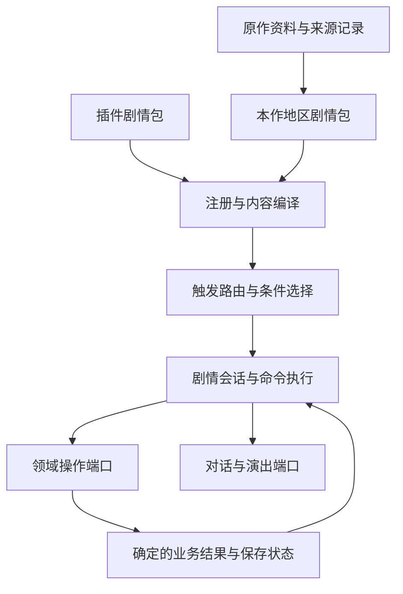

# 完整绿宝石的剧情内容架构

本文是2026-10-04提出的改造方案，**不是已实现API规格**。运行中可用的参数仍以[剧情语言](../engine/story/STORY_LANGUAGE.md)为准，完成状态由[STATUS](../project/STATUS.md)维护。目标是在现有网页引擎上持续转写完整绿宝石，同时让其他游戏及插件复用剧情机制。

## 当前结构与真实问题

剧情并非全部放在一个story.js里。核心StoryEngine负责条件与事件选择，CommandRunner负责命令树，FieldDirector负责演员和镜头，StoryApplication连接领域服务；scenes.js已有独立演出内容。但本作事件仍集中在dist/packs/emerald/story.js，下面几个问题会随全作内容增长而放大。

| 当前情况 | 对完整复刻的影响 | 改造方向 |
| --- | --- | --- |
| story.js混合序章、通用治疗、训练家结算、告示牌及招式表现配置 | 不同作者改同一文件，职责和依赖难定位 | 分地区剧情包，公共流程与表现定义另有归属 |
| 交互经常依赖object.kind；告示牌用script.includes推断文本 | 同类NPC无法自然对应独立原作脚本，拼错也可能显示通用文本 | 稳定对象身份与显式脚本绑定，缺失引用报错或明确pending |
| 全局events.find选择首个命中；插件放在本作事件前 | 数组顺序成为隐含覆盖规则，地区增加后冲突难查 | 声明式入口、索引、明确优先级与覆盖政策 |
| build闭包承担大量状态判断、文案和参数拼接 | 难以静态审计、翻译和复用；数据作者需要理解JS细节 | 数据脚本、对话目录、参数化公共子脚本 |
| 战斗结果触发另一组事件；没有持久执行游标 | 长剧情难续接，无法从稳定暂停点恢复 | 带关联身份的领域结果与可恢复剧情会话 |
| completed、奖励账本与flags分别存在 | 混用会造成重复奖励或永久阻塞 | 明确业务里程碑、演出完成和变量寿命 |
| 世界交互层包含具体原作时钟script名称 | 新原作特殊互动可能继续往应用入口添加分支 | 通过绑定脚本调用注册领域操作 |

现有references明确记录未转写C脚本，不再是完全静默悬空；但“标记pending”仍不等于绑定了可执行剧情。当前序章演绎也不等于完整原作。此次保持只读pret/pokeemerald修订731ad5bfd6e6f265508d0efcca0ba42f9dcf5881。

## 一个内容入口，明确各层职责



编译是加载时建立目录、解析引用和预检，不是生成C解释器。分层沿用现有依赖方向：内容提供数据，核心不读取绿宝石地图名、人物名或DOM；应用层提供端口，表现层消费已经确定的结果。

| 所有者 | 只负责什么 | 不负责什么 |
| --- | --- | --- |
| StoryCatalog / Compiler（新增） | 剧情包注册、命名空间、引用、参数、来源索引、命令预检 | 执行剧情、修改游戏状态 |
| StoryEngine / Router（演进） | 由触发上下文查候选，按条件与明确选择规则找到入口 | 背包容量、战斗胜负、对话播放 |
| StorySession（新增） | 调用帧、稳定节点、暂停/续接、资源生命周期、恢复政策 | 重新计算战斗或重做奖励 |
| CommandRunner（复用） | 命令验证、顺序/并行执行；接收脚本调用与暂停协议 | 物种、地图、剧情阶段硬编码 |
| StoryApplication（收窄） | 装配命令端口与领域结果交接 | 保存所有地区的剧情或变成万能领域服务 |
| 各领域Application / Service（复用） | 物品、治疗、战斗、设施、世界变更的验证和提交 | 决定NPC台词、自动标记整段剧情完成 |
| 对话/导演（复用并演进） | 文本、选项、移动、镜头、音频及清理 | 决定给不给道具、战斗算不算胜利 |

这些是职责边界，不要求每个名词对应一个新类。只为有独立状态或校验责任的模块增加实现，不引入重复总线、第二套库存或第二份世界状态。

## 内容按地区组织，按身份引用

建议目标目录如下。它们是拟建路径，目前没有这些目录，不得按图索骥声称已能调用。

```text
dist/packs/emerald/story.js                  # 最终只导出装配后的本作剧情集合
dist/packs/emerald/story/
  manifest.json                            # 本作剧情包清单和依赖
  common/                                  # 治疗、商店等参数化公共脚本
  regions/littleroot/                       # 地区业务边界，不按某个AI任务建目录
    bundle.json                            # 本地区资源清单、导出与依赖
    bindings.json                          # 对象/地图回调/坐标入口 → 脚本
    scripts.json                           # 分支、领域调用、演出与稳定节点
    movements.json                         # 可复用移动序列
    dialogues.zh-CN.json                    # 文本、逐行说话人、表情及插值
    sources.json                           # 固定参考label与转写差异
  regions/oldale/...
dist/plugins/<plugin>/...                   # 同一合同的扩展包
```

小地区可以用一个bundle文件内嵌内容，不强制产生五个小文件；增长后按上述职责拆开。地图网格、物种、道具等仍留在现有content分类目录，不复制到剧情包。sources.json是项目的来源记录，**不位于只读sources/目录**。

地图、对象、脚本、对话、业务奖励各有身份，不能用对象坐标或中文标题代替ID。原作对象优先使用map与local_id，动态Actor使用持久UID；角色搬家时引用Actor身份或显式绑定，不用“某坐标上的第一个NPC”。原作label保存在来源映射中，JS剧情ID由包命名空间管理，二者不是强制同名。

bindings按完整来源label或对象身份绑定脚本。允许多个对象复用同一脚本，调用时传入经校验的actor、speaker、shop等参数。告示牌是普通绑定入口，文本来自对话ID，不再根据字符串包含TownSign、May、Route判断。已有开发演绎明确记录为项目内容，不能将近似文案标成原作已还原。

清单加载复用现有内容管线的相对路径、部署迁移和只读快照原则；新增剧情部分须同步浏览器/Node加载器、导入工具所有权与校验。app.js只加载目录，不逐个导入地区或插件。基础剧情与插件经过同一编译、引用及命令合同。

## 触发与地图回调

入口描述至少包含trigger、map或对象/区域selector、requires、script，以及可选priority和消费政策。默认精确对象入口，通用治疗/商店模板必须显式声明，不用全局兜底把缺失原作脚本吞掉。

候选按trigger及map/object/script建立索引；加载顺序不影响优先级。交互入口只选择一个拥有者；同优先级、同排他组的多个有效候选产生带入口ID的冲突诊断，不默默取第一个。可静态确定的重复绑定在编译时报错；复杂条件的重叠无法仅靠静态校验证明，在实际解析时检测。普通事件观察使用已有事件系统，不与排他剧情入口混在一起。

插件可以新增入口、通过条件提供明确高优先级候选；替换原作入口要声明目标和所需宿主能力。依赖缺失、多个替换拥有者或未授权覆盖在装配时报错；不因插件数组放在前面就自动获得整个原作故事的覆盖权。

地图生命周期分三类，不把原作MapScripts全部转成step：

1. **准备地图投影**：依据状态配置对象位置、可见性等，无对话和动画，在首帧可见前完成。重建投影不重复发奖。
2. **地图访问/进入后的自动剧情**：传送/连接进入、读档恢复要区分，内容显式声明重复与恢复政策；临时flag寿命按原C调用点转写，不默认等同visit。
3. **交互、到达格及领域结果**：继承现有interact/step/battleResult能力，增加稳定上下文和结果关联身份。

原作每一种MAP_SCRIPT常量应按对应C执行时机映射并验证，不能仅靠名字猜成以上某一类。世界服务报告通用生命周期，剧情层选择业务；不在World.enter里加OldaleTown之类的分支。地图载入自动剧情与玩家输入互斥；队列有容量上限、去重键和明确busy政策，不缓存过期的按键交互。移动/演出产生的脚步默认不再次触发普通到达剧情，保留现有约束。

## 公共子脚本、对话与领域结果

子脚本接受声明类型的参数，可返回有限、可序列化的结果；call有独立调用帧及局部变量。没有eval、任意JS字符串或任意C special调用。静态调用环先拒绝，深度与指令预算有上限；常规循环用有界循环/明确重入描述，不能用无限递归模拟goto。

对话目录描述逐行speaker、portrait/expression、文本及允许的插值。插值只通过声明的只读查询/脚本参数读取玩家名、数量或变量，不开放访问整个对象的路径表达式。choice仍是命令，由会话处理可见/可用条件、禁用原因、取消、默认与超时，再将结果交给明确分支；文本播放器不直接奖励、设置旗标或启动战斗。对话历史由对话日志服务按容量政策保存，回看不执行原命令。

公共脚本可组合“治疗→播报”“购买→结果分支”“给物品→成功或背包满”；不同地区传角色/文案/店铺参数。原作special先找到领域所有者，再注册有限schema的操作及结果，不能为了一个NPC往StoryApplication追加具体人物逻辑。

领域命令返回结构化结果，例如奖励领取的ok、alreadyGranted、inventoryFull。成功与已领取分支可按业务分别处理；内容无权把失败伪装成成功。容量判断与提交仍由Inventory/PartyStorage完成，**预检查后再grant不能替代原子提交**。未知操作、非法参数是错误；容量不足等预期业务结果才进入剧情分支。非幂等动作不能在错误后无条件重试。

以原作古辰镇商店员工为代表，目标可验证流程是：

```text
入图配置员工/拦路NPC → 绑定商店员工脚本
  → 读取领取事实/临时变量 → 按玩家朝向选择移动序列
  → 公共商店介绍对话 → 领域领取操作
      ├─ inventoryFull：背包满台词，保留再次领取入口
      ├─ ok：领域原子提交奖励与领取事实，播放说明
      └─ alreadyGranted：药品说明，不重复发放
  → 释放演员/音乐/输入控制
```

来源：只读data/maps/OldaleTown/scripts.inc的OldaleTown_OnTransition、OldaleTown_EventScript_MartEmployee、ExplainPokemonMart及BagIsFull；原作领取flag时机仍须按脚本逐分支验收。这是验收目标，不是当前完整员工剧情已实现声明。

## 状态、长剧情和失败恢复

三种状态不能混用：业务里程碑说明实际发生了什么；completed说明一段事件完整执行；会话游标说明目前停在哪一步。后续剧情资格默认依赖业务事实，只有确实要求整段前置演出完成时才用after。章节/任务面板是事实的派生视图，不强制再保存一份chapter数字并由三套标记同步推进。

变量声明包含owner、类型、默认值与生命周期：永久剧情变量、地图访问变量、调用帧局部变量。原TEMP标记按实际来源寿命映射。插件写自身状态或显式授权的业务操作，不获得任意核心flags写权。现有flag命令和既有状态不能假定已经具备这套声明校验。

新增会话只在**稳定节点**恢复，不保存动画毫秒、DOM、Promise或函数闭包。脚本节点必须有稳定ID；游标不依赖数组下标。会话记录脚本/内容版本、调用帧、局部值、等待种类及关联token，校验尺寸和引用。移除插件/缺少脚本时明确报告并按内容声明的退出落点清理，禁止悬挂控制权；开发存档仍无历史迁移要求。

战斗续接采用明确握手：

```text
脚本到battle节点 → 记录会话关联token并交接战斗
  → 释放野外演出控制，战斗拥有输入
  → 领域提交确定结果与回执 → 对应会话选择胜/负/逃分支
  → 重建当前场景投影、取得演员控制 → 继续对白/移动
```

不再用b.script字符串猜属于哪条长剧情。结果token去重且限定发起会话；同一次结果既不重复恢复也不重复付奖。结果/业务回执与恢复游标在同一个保存快照中协调，避免“奖励已发生但游标还在奖励前”。必须重复提交的动作由领域稳定operation ID保证幂等；普通演出可按声明安全重播，战斗、扣款等不可重放。

这不等于支持任意战斗中途存档。首阶段只承诺战斗前及结果提交后的稳定检查点；活跃战斗的恢复需要另有战斗会话合同。在不支持保存的节点明确锁定保存；错误时释放控制并保留合法业务状态，按恢复政策重建场景或回到检查点，不假装将整段故事回滚。正常退出、取消、页面关闭和异常都使用会话资源清理。

自动状态变更和会话续接应先完成或失败，再开放下一条输入，避免多个异步故事同时修改同一玩家/演员。原作长剧情的视觉连贯性通过导演、演出实际完成和地图投影保证，不靠随意增加wait毫秒。

## 对插件的承诺与边界

拟增加api.story.registerBundle(localId, bundle)作为数据注册入口，与本作使用相同合同；bundle的子脚本/文本/入口返回完整命名空间ID。这是**计划API，当前不能调用**。现有api.story.register仍是可用事件入口，在迁移期进入同一目录；按实际需求逐步迁移，不为兼容旧实现保留两套长期执行器。

插件可新增地区、NPC/告示牌绑定、自动剧情、公共子脚本、选择分支、领域操作调用及演出；规则计算仍通过已有领域扩展点。自定义命令必须声明输入、输出、资源、恢复/幂等政策和宿主授权，由可信宿主装配；不暴露直接注册任意状态写处理器的后门。纯build可作为高级编程入口，经过冻结快照和同一命令校验，但不能成为持久会话里保存的闭包。

持久会话执行已编译且节点身份稳定的脚本。动态build只能产生经过预检的短事件，或引用这些稳定脚本；不把会随状态变化而重排的临时命令数组当作可恢复游标。这样保留高级内容入口，同时避免读档后恢复到另一个动作。

插件不能跳过库存/队伍容量、直接伪造战斗结果、改核心状态、读取私有命令详情或用渲染决定进度。相关限制由注册与执行合同承担，不要求上层作者自觉遵守才能成立。

## 诊断、来源和验收

装配一次性检查：命名空间/重复ID、脚本和对话引用、对象绑定、地图与坐标、条件查询、领域操作schema、参数类型、调用环、恢复节点和插件依赖。错误携带bundle文件路径、入口/脚本ID及节点ID，便于直接定位内容，不只输出“剧情失败”。

原作来源覆盖表由运行目录与来源记录生成：绑定到可执行脚本、项目演绎、明确pending、明确无脚本分别统计。references与故事来源清单不能各维护一份独立完成状态；原有pending记录在迁移中与运行目录交叉检查，完成标记由验证证据支持。scripts.inc的call/goto、移动和special依赖可抽取成审计索引，但不自动宣称可执行或已还原。

| 验收层 | 必须证明什么 |
| --- | --- |
| 注册/编译 | 缺引用、越界、歧义、参数错误在任何状态写入前失败；诊断能定位文件与节点 |
| 纯选择/执行 | 注册顺序无关、互斥/优先级明确，条件/调用帧不串扰，暂停/重复结果符合协议 |
| 真实领域组合 | NPC触发→方向移动→领取或背包满→重入；不是mock最终剧情结果 |
| 战斗与恢复 | 胜/败/取消、回执去重、提交后表现故障、保存重载后续接，不重复奖励或再打一次 |
| 原作还原 | 按固定参考逐项验地图回调、条件、TEMP寿命、方向分支、flag时机和特殊领域结果 |
| 浏览器 | 键盘/触屏选择推进、逐字/立绘、切图/控制释放和reducedMotion；headless不代替观感验收 |

每个阶段运行新增及受影响测试一次，证据记录涉及内容与源码范围；未改模块复用有效记录。结构与合同阶段收口再全量回归，不为文档编辑重跑全部战斗规则。

## 执行顺序与交付边界

| 阶段 | 交付 | 代表验收 |
| --- | --- | --- |
| 1 内容归属与绑定 | 拆现有序章/训练家/公共脚本；story.js仅装配；建立bundle编译/引用合同和显式绑定，移出招式表现配置 | 当前序章行为保持；告示牌不嗅探；缺失/歧义绑定写前失败；独立插件地区无需改app |
| 2 作者语言与对话 | 参数化call、局部变量、对话目录/插值/逐行角色、choice政策、领域结果分支 | 古辰镇员工成功/背包满/已领取与方向分支，实例互不串状态 |
| 3 生命周期与续接 | 地图准备/进入回调、会话稳定节点、战斗结果关联/保存、统一资源清理 | 主线战斗后自动继续；表现失败/重载不锁死或重复领取；入图投影无闪现 |
| 4 原作业务持续扩充 | 按地区转写剧情/移动/来源及完整性报告，更新接手Skill | 每个区域含回调、NPC、标牌、支线/主线、失败与重入，证据对照固定原作 |

阶段1先采用现有可执行命令，不等待完整新语言才能迁移；阶段2涉及不可恢复命令先明确禁存，阶段3再提供稳定点恢复。没有旧档兼容负担，但每次接口变化仍同步类型、规格、示例和验证。无需一次性重写引擎，更不能只完成文件拆分就宣称全作剧情架构已齐备。
